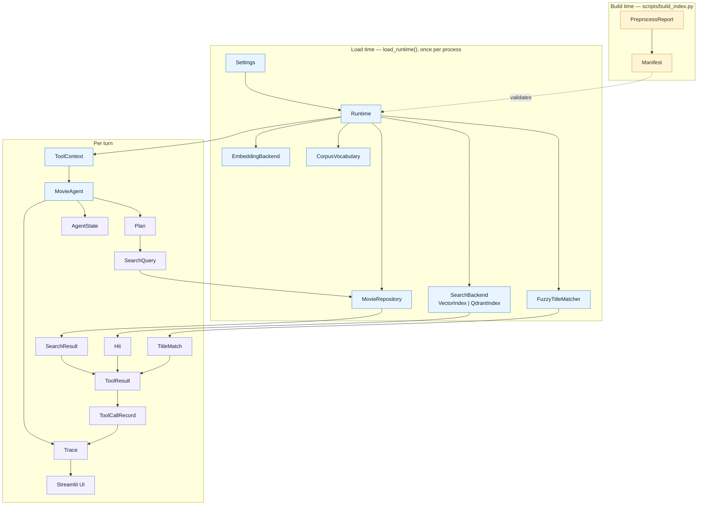
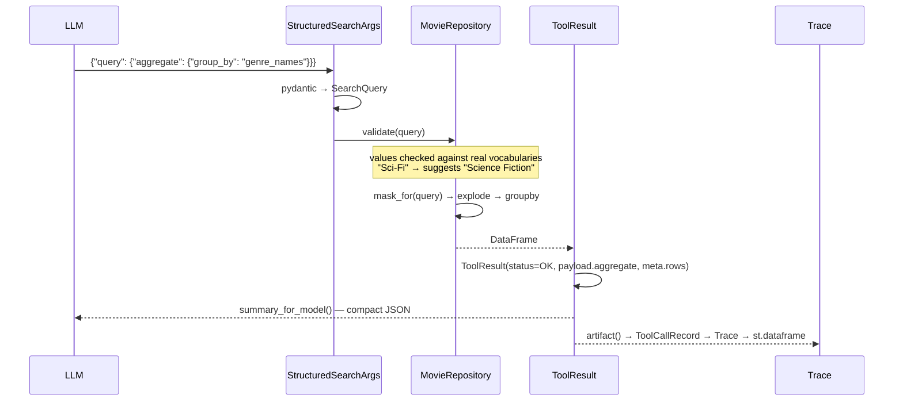

# Class and model reference

Every class in `src/movieagent`, what it represents in the pipeline, and how it connects to the
others. Around 65 types across eight layers — but they exist to serve one idea, so start here.

## The one idea

Text comes in, text goes out, and **everything in between is a typed object**. The language model
is confined to two jobs: turning English into a typed request (`Plan`, `SearchQuery`) and turning
typed results back into English. It never touches a number, never picks a movie, and never decides
what "no results" means.

That gives the codebase its shape: for each stage of the pipeline there is a small immutable type
that carries the result of that stage to the next one.

```
"funny sci-fi after 2010"
      │  LLM interprets
      ▼
  SearchQuery ──────── the request, validated and closed
      │  MovieRepository executes
      ▼
  SearchResult ─────── the data, with the true total alongside capped rows
      │  tool wraps
      ▼
  ToolResult ───────── the outcome envelope: status + payload + refs
      │  binding splits
      ├──► summary_for_model()  → the LLM sees a compact JSON summary
      └──► artifact()           → the UI sees the full typed payload
                                   │
                                   ▼
                              ToolCallRecord → Trace → Streamlit
```

**`MovieRef` is the spine.** `{movie_id, title, year}` — the smallest thing that identifies a film.
It is what tools return, what conversation memory stores, what grounding checks against, and what
"the third one" resolves to. When in doubt about how two parts of the system relate, they probably
relate through a `MovieRef`.

---

## Ownership at a glance

Who constructs whom, and what lives for how long.



Blue objects are built once and shared read-only across Streamlit sessions (`@st.cache_resource`) —
which is why nearly all of them are frozen or documented as immutable. Purple objects live for one
turn. Yellow objects exist only during the offline build.

---

## 1. Configuration — [`config.py`](../src/movieagent/config.py)

One root object, split into groups so each subsystem receives only what it needs.

| Class | Kind | Represents |
|---|---|---|
| `Settings` | `BaseSettings` | The root, loaded from `.env` + environment. Frozen, cached by `get_settings()` |
| `LLMSettings` | `BaseModel` | Chat endpoint: base URL, key, model, temperature, timeout, retries |
| `EmbeddingSettings` | `BaseModel` | Embedding backend — **deliberately separate** from `LLMSettings` |
| `VectorStoreSettings` | `BaseModel` | Which vector engine, and where it lives |
| `RetrievalSettings` | `BaseModel` | `top_k`, `similarity_floor`, `min_lexical_coverage`, display cap |
| `FuzzySettings` | `BaseModel` | Confidence bands: `accept`, `ambiguous`, `tie_margin` |
| `AgentSettings` | `BaseModel` | Loop guards: recursion limit, tool-iteration cap, timeout, message window |
| `PathSettings` | `BaseModel` | Where the CSVs, parquet, embeddings, manifest and Qdrant directory live |
| `EmbeddingProvider` | `StrEnum` | `sentence_transformers` \| `openai_compatible` |
| `VectorBackend` | `StrEnum` | `numpy` \| `qdrant` |

**Why the groups exist.** `Settings` is flat for readability in `.env`; the grouped views are
`@property` accessors that construct the sub-model on access. Subsystems take the sub-model, not
the root — `FuzzyTitleMatcher(repo, settings.fuzzy)` cannot accidentally read an LLM key.

**Why LLM and embeddings are separate:** OpenRouter serves chat completions but no
`/v1/embeddings` endpoint, so the embedding backend needs its own base URL.

**Validation is layered.** Structure is checked at construction; credentials at the point of use
(`LLMSettings.require_key()`). That is what lets preprocessing, structured search, fuzzy matching
and local embeddings all run with no API key at all.

---

## 2. Data layer — the domain vocabulary

### Identity types — [`schema.py`](../src/movieagent/data/schema.py)

| Class | Kind | Represents | Flows |
|---|---|---|---|
| `MovieRef` | frozen dataclass | `{movie_id, title, year}` — a film's identity, nothing more | Every tool → `ToolResult.refs` → `AgentState.last_results` → grounding |
| `FuzzyCandidate` | frozen dataclass | A scored title match: `ref` + `score` + `matched_on` | `FuzzyTitleMatcher` → `TitleMatch` → clarification UI |
| `RetrievedDoc` | frozen dataclass | A semantic hit: `ref` + `score` + the embedded document text | `semantic_search` → trace "retrieved context" → `rag_answer` prompt |
| `NumericField` | `StrEnum` | The seven comparable fields (rating, votes, runtime, budget, revenue, popularity, year) | Closed vocabulary for `Condition` |
| `ListField` | `StrEnum` | The seven list-valued fields (genres, keywords, companies, countries, languages, cast, directors) | Closed vocabulary for grouping and membership filters |

`MovieRef` is deliberately tiny because it is the unit of conversational memory: `MemorySaver`
retains every checkpoint for the process lifetime, so result *rows* must never enter state.

`RetrievedDoc` carries the exact text that was embedded — the same string shown as "retrieved
context" and the same string that grounds generation. One rendering path, so nothing can drift.

### The query DSL — [`query.py`](../src/movieagent/data/query.py)

| Class | Kind | Represents |
|---|---|---|
| `SearchQuery` | `BaseModel` | A complete structured request: conditions, list filters, year range, sort, limit, optional aggregation |
| `Condition` | `BaseModel` | One numeric comparison: `field` (enum) + `op` + `value` |
| `ComparisonOp` | `StrEnum` | `gt`, `gte`, `lt`, `lte`, `eq`, `between` |
| `AggregateSpec` | `BaseModel` | `group_by` + `metric` + `limit` + sort direction |
| `AggregateMetric` | `StrEnum` | `count`, `avg_rating`, `sum_revenue` |
| `GroupBy` | `StrEnum` | What an aggregation may group by (the list fields, plus `release_year`) |

`SearchQuery` **does three jobs**, which is why its shape is load-bearing:

1. the structured-search request,
2. the hybrid pre-filter for semantic search,
3. the unit of conversational memory (`AgentState.active_query`).

Its expressive ceiling is deliberate: conditions are ANDed, there is no OR across fields and no
nested boolean groups. `merged_with()` implements the carry-forward rules — a new condition on an
already-constrained field *replaces* it, and a non-empty list filter *replaces* rather than unions
("actually, comedies" means comedies, not sci-fi *and* comedies).

### Access and provenance

| Class | Kind | Represents | Notes |
|---|---|---|---|
| `MovieRepository` | class | Read-only access to the processed frame — **the seam**; nothing above it writes pandas idioms | Builds exploded views and term indexes once at load; immutable thereafter |
| `SearchResult` | frozen dataclass | `rows` (capped) + `total` (true count) + `refs` + `excluded_unknown` + `binding` | Keeping `total` beside capped `rows` is what stops a truncated view passing for a complete answer |
| `Manifest` | dataclass | Provenance stamp: source hashes, row count, embedding model + dimension, template version | Read at load; mismatch raises `ArtifactStaleError` rather than answering plausibly from stale data |
| `PreprocessReport` | dataclass | Build-time counts: unmatched joins, missing fields, zeros treated as unknown | Written into the `Manifest` so documentation quotes real numbers |

`MovieRepository` is the most methods-dense class in the repo. The four that matter:
`validate()` (checks values against real vocabularies, with fuzzy suggestions), `mask_for()`
(a `SearchQuery` → boolean row mask), `search()`, and `aggregate()`.

---

## 3. Retrieval layer

### Vector search — [`backend.py`](../src/movieagent/retrieval/backend.py)

| Class | Kind | Represents |
|---|---|---|
| `SearchBackend` | `Protocol` | The contract: `search`, `similar_to`, `pool_size`, `__len__`, `dimension` |
| `Hit` | frozen dataclass | One result: `position` (row index) + `score` (cosine) |
| `Restriction` | frozen dataclass | A pre-filter in **both** forms: the pandas `mask` and the source `SearchQuery` |
| `VectorIndex` | class | The in-process exact-cosine index (default backend) |
| `QdrantIndex` | class | The same contract over a Qdrant collection, embedded or served |
| `UntranslatableFilter` | `Exception` | A predicate with no payload-filter equivalent → falls back to an id list |

`Restriction` carrying two representations is the key design point. Numpy wants a boolean mask;
Qdrant wants a server-side payload filter. Rather than translating at every call site, the
restriction carries the source query *and* the mask, and each backend takes what it can enforce.
That dual representation is also the correctness check — the two must select identical rows, and
`scripts/benchmark_vector_backends.py` asserts exactly that.

`Hit.position` is a **row position**, not a movie id — the repository frame, the document list and
the vector rows all share one order, so a position indexes all three.

### Title matching — [`fuzzy.py`](../src/movieagent/retrieval/fuzzy.py)

| Class | Kind | Represents |
|---|---|---|
| `FuzzyTitleMatcher` | class | Matches user-typed titles against both `title` and `original_title` |
| `TitleMatch` | frozen dataclass | The banded decision: `outcome` + `best` + `candidates` + `reason` |
| `MatchOutcome` | `StrEnum` | `match` \| `ambiguous` \| `not_found` |

The output is a **banded decision, not a winner**. The dangerous failure is not a low score — it is
returning film A at 90 when film B scored 89, so near-ties become `AMBIGUOUS` regardless of score.

### Query sanity — [`coverage.py`](../src/movieagent/retrieval/coverage.py)

| Class | Kind | Represents |
|---|---|---|
| `CorpusVocabulary` | class | Every word appearing in the ~4,800 semantic documents (~33,500 words) |
| `Coverage` | frozen dataclass | `ratio` + `known` + `unknown` words for one query |

Checked *before* embedding: if a query is not made of words this corpus uses, no amount of vector
geometry will reveal that afterwards. This is what catches gibberish, because an absolute
similarity floor demonstrably cannot on this corpus.

---

## 4. LLM layer — [`llm/`](../src/movieagent/llm/)

| Class | Kind | Represents |
|---|---|---|
| `EmbeddingBackend` | `Protocol` | `embed_documents` / `embed_query` / `dimension` |
| `SentenceTransformerBackend` | class | Local embeddings — no API key, offline after first download |
| `OpenAICompatibleBackend` | class | Any `/v1/embeddings` endpoint: OpenAI, vLLM, Ollama, LM Studio |
| `SanitizedChatOpenAI` | `ChatOpenAI` subclass | The chat model with reasoning content stripped at the boundary |
| `ScriptedChatModel` | `BaseChatModel` subclass | Test double replaying a fixed response sequence |

**Documents and queries are embedded through separate methods** on purpose: BGE models need an
instruction prefix on queries only, and collapsing both into one `embed()` is the standard way to
silently lose retrieval quality.

`SanitizedChatOpenAI` is *subclassed* rather than wrapped, because `bind_tools` and
`with_structured_output` return bindings around `self` — so sanitization stays in force through the
whole graph rather than being bypassed by the first binding.

`ScriptedChatModel` is substituted at the `BaseChatModel` level, so the **real graph** runs in
tests: reducers, conditional edges, `ToolNode`, checkpointer and interrupt all execute. Only the
model is fake.

---

## 5. Tool layer — [`tools/base.py`](../src/movieagent/tools/base.py)

| Class | Kind | Represents |
|---|---|---|
| `Outcome` | `StrEnum` | The seven states a tool can end in |
| `ToolResult` | frozen dataclass | The envelope: `status` + `message` + `refs` + `payload` + `meta` |
| `ToolContext` | frozen dataclass | Everything the tools need, injected once |
| `Tool` | `Protocol` | A tool is a pure function of context and arguments |

### `Outcome` is the most important enum in the repo

`OK` · `EMPTY` · `NOT_FOUND` · `AMBIGUOUS` · `LOW_CONFIDENCE` · `INVALID_INPUT` · `ERROR`

With raw return values, "no movies match your filters", "your filter was invalid" and "I found
three equally likely films and refuse to guess" would all be an empty list. Keeping them distinct
is what lets the graph route on the *outcome* — `AMBIGUOUS` is the status `_after_tools` reads to
divert into the clarification interrupt.

`OUTCOME_GUIDANCE` maps each outcome to instructions generated *into* the prompt from the enum,
rather than hand-written there — so adding a status cannot leave the prompt stale.

### `ToolResult`'s two faces

```python
result.summary_for_model()   # compact JSON, refs capped at 25 → the LLM
result.artifact()            # full typed payload → the UI and the trace, never a prompt
```

This split is why the UI can render a 25-row table the model never saw, and why numbers reach the
screen from the data rather than from prose.

### `ToolContext` — the dependency bundle

`settings`, `repository`, `matcher`, `index`, `embedder`, `documents`, `vocabulary`, `answer_fn`.

`answer_fn` is a plain `(system, user) -> str` callable rather than a chat model — that is what
keeps the `tools/` package free of LangChain imports.

### The five tools (functions, not classes)

| Tool | Uses from context | Returns |
|---|---|---|
| `structured_search` | `repository` | Filtered rows or an aggregation |
| `fuzzy_movie_search` | `matcher` | A resolved reference, or candidates to choose from |
| `semantic_search` | `index`, `embedder`, `repository`, `vocabulary` | Ranked `RetrievedDoc`s |
| `movie_details` | `repository` | One complete record |
| `rag_answer` | `repository`, `answer_fn` | Prose grounded in named movie ids |

---

## 6. Agent layer — [`agent/`](../src/movieagent/agent/)

| Class | Kind | Represents |
|---|---|---|
| `MovieAgent` | class | Compiles and runs the graph; owns the model, tools, checkpointer |
| `Plan` | `BaseModel` | The intent stated before any tool runs: steps, rationale, filters, resolved ids |
| `PlanStep` | `BaseModel` | One tool plus a one-clause `why` |
| `ToolName` | `StrEnum` | The five tools, as a closed vocabulary for the planner |
| `AgentState` | `TypedDict` | The checkpointed conversation state, keyed by `thread_id` |
| `TurnResult` | dataclass | One turn's outcome as the UI consumes it: `answer` + `trace` + `interrupted` |
| `Trace` | dataclass | Everything the UI shows about a turn: plan, calls, warnings, timings |
| `ToolCallRecord` | dataclass | One tool invocation as it actually happened |
| `StructuredSearchArgs`, `FuzzySearchArgs`, `SemanticSearchArgs`, `MovieDetailsArgs`, `RagAnswerArgs` | `BaseModel` ×5 | Argument schemas the model fills in when calling each tool |

**`Plan` is a schema rather than free text** for two reasons: R-102 needs a concise tool-selection
explanation that is always present, and a `rationale` field capped at 240 characters is
structurally incapable of carrying chain-of-thought. It also resolves "the first one" into concrete
ids *before* execution, so tools never receive deictic arguments.

**`Trace` vs `AgentState`** — the distinction that most often confuses:

| | `AgentState` | `Trace` |
|---|---|---|
| Lifetime | Persists across turns, checkpointed | One turn, rebuilt each time |
| Contents | References only — never rows | Full artifacts, rows, documents, timings |
| Purpose | Memory: what "the third one" means next turn | Display: what the user sees in the trace panel |
| Why the split | `MemorySaver` keeps every checkpoint forever | Discarded after render |

The argument schemas (`StructuredSearchArgs` and friends) are worth noticing: `StructuredSearchArgs`
has a single field typed as `SearchQuery` — so the DSL *is* the tool's signature, and the model's
JSON is validated by pydantic before the tool is entered. A malformed query is a `ValidationError`
fed back to the model, not a crash.

---

## 7. Runtime and infrastructure

| Class | Kind | Represents |
|---|---|---|
| `Runtime` | frozen dataclass | Everything long-lived, built once per process |
| `TraceSink` | class | Append-only JSONL sink for traces — best-effort, never breaks a turn |
| `MovieAgentError` | `Exception` | Base for everything the package raises deliberately |
| `ArtifactError` | `Exception` | Artifacts missing, unreadable, or stale |
| `ArtifactStaleError` | `Exception` | Artifacts do not match their sources or embedding model |
| `ConfigurationError` | `Exception` | Invalid configuration, or a credential missing at point of use |
| `EmbeddingBackendError` | `Exception` | The embedding backend could not be built or failed |

**`Runtime` is the assembly point:** `settings`, `repository`, `matcher`, `index`, `embedder`,
`documents`, `vocabulary`, `manifest` — plus `tool_context()`, which hands the same objects to the
tools. One place knows how the pieces fit, so `app.py`, the scripts and the tests all construct the
system identically.

**The exception hierarchy is deliberately narrow.** Expected business outcomes — movie not found,
ambiguous title, empty result, invalid filter — are **not** exceptions. They are `ToolResult`
statuses, because the agent has to reason about them and ask the user a question rather than abort.
An exception here means the installation, artifacts or configuration are genuinely wrong.

## 8. UI layer — [`ui/`](../src/movieagent/ui/)

No classes, by design — only functions over the typed `Trace`: `render_results`, `render_trace`,
`is_record`, `strip_markdown_tables`. There is no second source of truth and nothing to parse.

---

## How they interact: three walkthroughs

### A. "How many movies per genre?" — the structured path



Objects touched: `SearchQuery` → `AggregateSpec` → `GroupBy` → `MovieRepository` → `ToolResult` →
`ToolCallRecord` → `Trace`. No `MovieRef`, because an aggregation returns groups, not films.

### B. "A movie about surviving alone on another planet" — the semantic path

`SearchQuery` (filters, if any) → `Restriction.from_query(repo, filters)` → `CorpusVocabulary.coverage()`
gate → `EmbeddingBackend.embed_query()` → `SearchBackend.search()` → `list[Hit]` →
`repo.refs_at()` → `list[RetrievedDoc]` → `ToolResult`.

Note the ordering: coverage is checked **before** embedding, and the restriction is applied
**before** ranking. Both are refusals to do expensive work on a question that cannot be answered
well.

### C. "Tell me about the matrix" — the ambiguous path

`FuzzyTitleMatcher.match()` → `TitleMatch(outcome=AMBIGUOUS, candidates=[FuzzyCandidate, ...])` →
`ToolResult(status=AMBIGUOUS)` → `_after_tools` reads the status → `clarify` node calls
`interrupt()` → `TurnResult(interrupted=True)` → UI shows the choices → user replies →
`resolve_choice()` → synthetic `HumanMessage` → back into `agent`.

This is the chain the whole `Outcome` enum exists for: a status set deep in the retrieval layer
changes the *shape of the conversation* three layers up.

---

## Which class do I touch when…

| I want to… | Change this | Not this |
|---|---|---|
| Add a filterable field | `NumericField` or `ListField`, then `MovieRepository.mask_for` | The prompts — the enum drives the schema |
| Add a new aggregation | `AggregateMetric` + `MovieRepository._apply_metric` | The tool — it just forwards `AggregateSpec` |
| Add a tool | `ToolName`, a module in `tools/`, an args model, `build_tools` | The graph — the tool list is data |
| Add a tool outcome | `Outcome` + `OUTCOME_GUIDANCE` (the prompt regenerates) | Any prompt text |
| Change what persists between turns | `AgentState` + its reducers | `Trace` — that is per-turn display |
| Change what the trace panel shows | `Trace` / `ToolCallRecord` + `ui/components.py` | The tools — artifacts already carry it |
| Swap the vector engine | Implement `SearchBackend`, register in `build_search_backend` | `semantic_search` — it speaks the protocol |
| Swap the embedding model | `EmbeddingSettings.model`, then rebuild | Any code — the manifest enforces the rebuild |
| Change a threshold | `Settings` (`.env`) | Constants in code — they are all config |

---

## The invariants that explain most design choices

1. **Numbers come from data, never from prose.** `ToolResult.artifact()` reaches the UI directly;
   the model only sees `summary_for_model()`.
2. **Business outcomes are statuses, not exceptions.** `Outcome` has seven members so the agent can
   reason about each one differently.
3. **Unknown is unknown, never zero.** Nullable `Int64` in the frame, `*_known` flags on money,
   NULL in SQLite, absent payload keys in Qdrant — the same rule enforced four times.
4. **The true total travels with capped rows.** `SearchResult.total`, `payload["total"]`,
   `pool_size` — a truncated view can never pass for the complete answer.
5. **Shared objects are immutable.** Everything in `Runtime` is frozen or documented read-only,
   because `@st.cache_resource` shares it across sessions and threads.
6. **State holds references, not rows.** `MemorySaver` retains every checkpoint for the process
   lifetime, so `MovieRef` is the only thing that persists.
