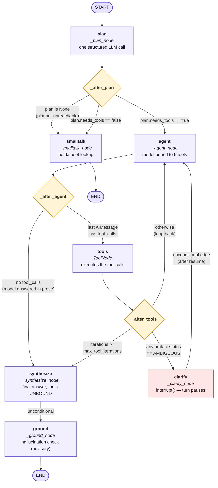
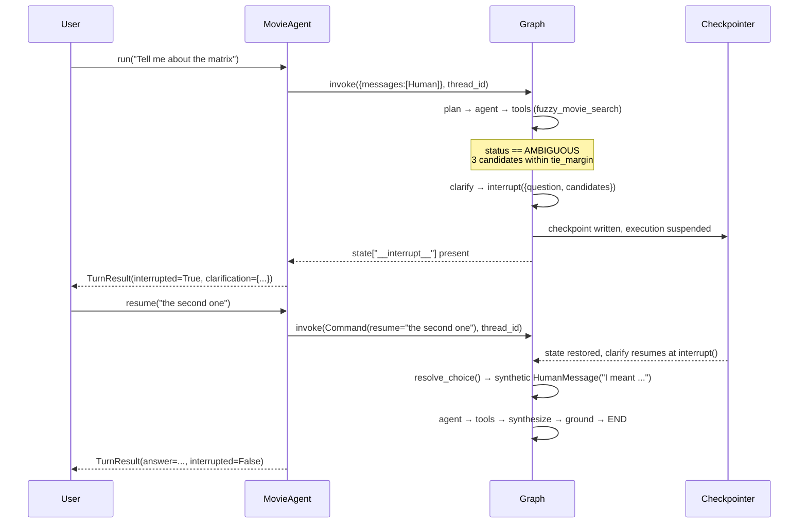

# LangGraph workflow — architecture, state, and node logic

An architectural breakdown of the agent in [`src/movieagent/agent/graph.py`](../src/movieagent/agent/graph.py),
its state channels in [`state.py`](../src/movieagent/agent/state.py), and the plan schema in
[`plan.py`](../src/movieagent/agent/plan.py).

The topology below was verified against `MovieAgent.mermaid()`, which renders the compiled
graph itself — so this document describes the graph that runs, not a graph that was intended.

**Why a hand-built `StateGraph` rather than `create_react_agent`:** the prebuilt agent has no
explicit planning stage (R-089) and — the deciding reason — cannot cleanly interrupt on a tool
*result*. R-043 requires exactly that shape: run the fuzzy matcher, and if it returns three
candidates within three points of each other, stop and ask the user. That is a conditional edge
reading `ToolResult.status`, and it only exists if you own the edges.

---

## 1. Workflow architecture diagram

Rectangles are processing nodes, diamonds are conditional-edge routing functions, stadiums are
terminals. Edge labels give the actual routing condition.



### The interrupt cycle, which the flowchart cannot express

`clarify` calls LangGraph's `interrupt()`. That is not a node that returns — it suspends
execution mid-node, and the checkpointer holds the state until a later `Command(resume=...)`
re-enters *the same node at the same point*.



The UI side of this is a single boolean: `app.py` keeps `awaiting_clarification` and calls
`agent.resume()` instead of `agent.run()` on the next message.

---

## 2. Deep dive: state representation

### Schema

Verbatim from [`state.py`](../src/movieagent/agent/state.py):

```python
class AgentState(TypedDict, total=False):
    """The checkpointed conversation state, keyed by ``thread_id``."""

    messages: Annotated[list[AnyMessage], trimmed_add_messages]
    question: Annotated[str, overwrite]
    plan: Annotated[dict[str, Any] | None, overwrite]
    active_query: Annotated[SearchQuery | None, overwrite]
    last_results: Annotated[list[dict[str, Any]] | None, overwrite]
    last_result_total: Annotated[int | None, overwrite]
    selected_movie_id: Annotated[int | None, overwrite]
    pending_clarification: Annotated[dict[str, Any] | None, overwrite]
    answer: Annotated[str, overwrite]
    deviations: Annotated[list[str] | None, overwrite]
    tool_iterations: Annotated[int | None, overwrite]
```

`total=False` means every key is optional — a first turn starts with only `messages` present, and
every reader uses `state.get(...)` with a default rather than indexing.

### The governing principle

R-092 names what must persist across turns — filters, result sets, selected movies — and all three
are **structured values, not prose**. Storing them as text and asking a language model to recover
them is a lossy round-trip; storing them as typed channels makes *"tell me about the first one"* an
array index (`ordinal_ref`, [state.py:170](../src/movieagent/agent/state.py#L170)) rather than an
act of recall.

The second principle is that **nothing large lives here**. `MemorySaver` retains every checkpoint
for the process lifetime, so result rows, retrieved document text and tool artifacts stay in the
turn's `Trace` object instead. What the state keeps is *references*: `{movie_id, title, year}`.

### Key-by-key

| Key | Type | Purpose | Update strategy |
|---|---|---|---|
| `messages` | `list[AnyMessage]` | The conversation: human turns, AI tool-call messages, `ToolMessage` results carrying typed artifacts | **Append + trim** via `trimmed_add_messages` |
| `question` | `str` | This turn's raw user text, lifted out for the trace and for `smalltalk` | Overwrite, written once by `plan` |
| `plan` | `dict \| None` | The `Plan` model dumped to JSON: intent, steps, rationale, filters, resolved ids | Overwrite; `None` signals planner failure |
| `active_query` | `SearchQuery \| None` | Filters carried across turns (R-148) — the object, not the rendered rows | Overwrite, with merge logic computed *before* the write |
| `last_results` | `list[dict] \| None` | Previous result set as `MovieRef` dicts — the referent for "the third one" | Overwrite, written by `synthesize` |
| `last_result_total` | `int \| None` | True match count, which may exceed `len(last_results)` | Overwrite |
| `selected_movie_id` | `int \| None` | The film currently under discussion | Overwrite; written by three different nodes |
| `pending_clarification` | `dict \| None` | Intended to describe an unanswered clarification | Overwrite — **see the note below** |
| `answer` | `str` | The user-facing answer text | Overwrite; cleared by `plan`, set by `synthesize`/`smalltalk`/failure paths |
| `deviations` | `list[str] \| None` | Plan-vs-actual differences and grounding warnings, shown in the trace | Overwrite of a *rebuilt* list — the node reads the old value and writes `[*old, *new]` |
| `tool_iterations` | `int \| None` | Intended tool-loop counter | Overwrite — **see the note below** |

### Reducer behavior

Two reducers, and the choice between them is deliberate.

**`trimmed_add_messages`** ([state.py:31](../src/movieagent/agent/state.py#L31)) wraps LangGraph's
`add_messages` (append, with id-based replacement) and then enforces `message_window` (default 8)
**at write time**. Three subtleties:

- The window keeps conversational *tone* — phrasing, follow-ups like "why that one?" — which the
  structured channels deliberately do not capture. Anything older is gone unless it survived as
  structured state, and that failure is *visible* ("I don't know what you mean") rather than silent.
- **The window drops previous turns, never the turn in progress.** A turn making seven tool calls
  produces 15 messages on its own; trimming those silently truncated the grounding payload and the
  trace, so the UI under-reported which tools had run.
- **Tool-call pairing is preserved.** An `AIMessage` carrying `tool_calls` must never be separated
  from its `ToolMessage` replies or the provider rejects the conversation, so the reducer walks
  backwards and re-admits any orphaned parent.

**`overwrite`** ([state.py:118](../src/movieagent/agent/state.py#L118)) is last-write-wins,
**including a write of `None`**:

```python
def overwrite(current: Any, update: Any) -> Any:
    return update
```

The subtlety is load-bearing. LangGraph invokes a channel's reducer *only when a node actually
writes that channel*, so "unchanged" is already expressed by not writing. An earlier version
returned `current` when `update` was `None`, which made a deliberate clear impossible — a
fresh-topic reset of `active_query` and the clearing of `pending_clarification` both silently
did nothing.

### `active_query` is merged in the node, not in a reducer (ADR-0027)

The merge rules live in `resolve_active_query` ([state.py:85](../src/movieagent/agent/state.py#L85)):

* `fresh_topic` → drop what was carried (without a reset path, filters accumulate forever and turn
  nine returns nothing);
* new filters on an existing set → layered per `SearchQuery.merged_with` (a new condition on an
  already-constrained field *replaces* it; a non-empty list filter *replaces* rather than unions —
  "actually, comedies" means comedies, not sci-fi *and* comedies);
* nothing new → carry the existing set unchanged.

This was a channel reducer until a live run proved that unsound. LangGraph's
`BinaryOperatorAggregate` assigns `values[0]` directly while a channel is still `MISSING`, applying
the operator only from the *second* write onward. The first-turn write therefore bypassed the
reducer entirely and put a raw sentinel into `active_query`, which every reader then called
`.is_empty()` on. Computing the value in the node removes the hazard: **what is written is already
correct, so no reducer has to run for state to be valid.**

### Two channels that are declared but inert

Both were verified by running the graph and reading the resulting checkpoint.

**`tool_iterations` is never incremented.** `plan` writes `0`; the only other reference is inside
`_after_tools` ([graph.py:359](../src/movieagent/agent/graph.py#L359)), which computes
`iterations = (state.get("tool_iterations") or 0) + 1` locally. But `_after_tools` is a *routing
function* passed to `add_conditional_edges`, and routing functions return a route — they cannot
write state. So the channel stays `0` and `iterations` is always `1`. Running three sequential tool
rounds confirms it:

```
tool rounds executed : 3
tool_iterations state: 0
```

The `max_tool_iterations` cap (default 6) therefore never fires from this path. What actually
bounds the loop is LangGraph's `recursion_limit` (default 25, set in `_config`) plus the model
choosing to stop emitting tool calls. The trace's separate check at
[graph.py:641](../src/movieagent/agent/graph.py#L641) counts `len(trace.tool_calls)` directly and is
unaffected.

**`pending_clarification` is only ever written as `None`** — by `plan` and by both branches of
`clarify`. Nothing assigns it a value. `describe_state` reads it to tell the planner about an
outstanding question ([state.py:189](../src/movieagent/agent/state.py#L189)), but that branch is
unreachable; the clarification flow instead relies on `interrupt()` plus the synthetic
`HumanMessage` that `clarify` injects on resume.

Neither is a live defect — the graph behaves correctly — but both are dead weight in the schema,
and the iteration cap is a guard that reads as active while doing nothing.

---

## 3. Step-by-step node and edge logic

### `plan` — `_plan_node` ([graph.py:237](../src/movieagent/agent/graph.py#L237))

**Reads:** `messages[-1]` for the question; the whole state via `describe_state`, which renders
carried filters, the previous result set (numbered, with ids), and the selected movie as a terse
block for the prompt.

**Executes:** one structured LLM call — `model.with_structured_output(Plan)` — before any tool runs.
The `Plan` schema is what makes this a plan rather than free text: `rationale` is capped at 240
characters by a validator, so a field asked to be concise is structurally incapable of growing into
chain-of-thought (R-102/R-104). It is also where deictic references become concrete ids (R-093), so
tools never receive "the first one" and stay independently testable.

**Writes:**

| Key | Value |
|---|---|
| `question` | the raw text |
| `plan` | `plan.model_dump(mode="json")`, or `None` on failure |
| `active_query` | `resolve_active_query(current, plan.filters, fresh_topic=plan.fresh_topic)` |
| `selected_movie_id` | `plan.resolved_movie_ids[0]` if any |
| `tool_iterations` | `0` |
| `answer` | `""` — **cleared deliberately** |
| `deviations` | `[]` |
| `pending_clarification` | `None` |

The `answer` reset matters more than it looks: state persists across turns by design, so a stale
answer from the previous turn would make `_after_plan` believe this turn had already failed and
route it to `smalltalk` without running a single tool.

On planner failure the node does not raise. It writes a user-facing `answer`, `plan: None`, and a
`"planning failed"` deviation, letting the routing function carry it to a terminal node.

### `_after_plan` ([graph.py:292](../src/movieagent/agent/graph.py#L292))

```python
if plan is None:               return "smalltalk"   # already produced an answer
if not plan.get("needs_tools", True): return "smalltalk"
return "agent"
```

Note the double duty of `smalltalk`: it is both the chit-chat path and the failure passthrough. It
checks `state["answer"]` first and returns immediately if one exists, so a failed turn is not billed
for a second model call.

### `agent` — `_agent_node` ([graph.py:302](../src/movieagent/agent/graph.py#L302))

**Reads:** `plan`, `active_query`, and `current_turn_messages(messages)` — everything back to the
most recent non-clarification human message.

**Executes:** invokes the model **bound to the five tools**. The plan is injected as a system-prompt
block (`_agent_messages`, [graph.py:327](../src/movieagent/agent/graph.py#L327)) listing intent,
selected tools, rationale, extracted filters, resolved ids, and filters carried from earlier turns.
The model executes a decision already made rather than improvising one.

**Writes:** `messages: [response]` — an `AIMessage` that either carries `tool_calls` or is prose.
On provider failure it writes a plain-language `AIMessage`, a user-facing `answer`, and appends to
`deviations`.

### `_after_agent` ([graph.py:351](../src/movieagent/agent/graph.py#L351))

Inspects `messages[-1]`: an `AIMessage` with a non-empty `tool_calls` list routes to `tools`;
anything else routes to `synthesize`.

### `tools` — LangGraph's prebuilt `ToolNode`

Executes each requested tool through the bindings in
[`tool_bindings.py`](../src/movieagent/agent/tool_bindings.py). Each binding returns a
`(content, artifact)` pair: `content` is `ToolResult.summary_for_model()` — compact JSON, refs
capped at 25 — and `artifact` is the full typed payload, which **never enters a prompt**. Every
binding is wrapped in `_guard`, converting an unexpected exception into a typed `ERROR` envelope so
a bug degrades one tool call instead of crashing the turn (the traceback is still logged at ERROR).

**Writes:** one `ToolMessage` per call, each carrying its artifact.

### `_after_tools` ([graph.py:357](../src/movieagent/agent/graph.py#L357)) — the reason this graph is custom

```python
for artifact in reversed(latest_tool_artifacts(list(state["messages"]))):
    if artifact_status(artifact) is Outcome.AMBIGUOUS:
        return "clarify"
if iterations >= self._settings.agent.max_tool_iterations:
    return "synthesize"
return "agent"
```

The routing key is the tool's **outcome**, not the model's opinion of it. `Outcome` is a closed enum
(`OK`, `EMPTY`, `NOT_FOUND`, `AMBIGUOUS`, `LOW_CONFIDENCE`, `INVALID_INPUT`, `ERROR`) and only
`AMBIGUOUS` diverts the flow — the others are handled by the model on the next `agent` pass, which
is how `EMPTY`-recovery (relax a filter and retry) works.

`latest_tool_artifacts` scans **only the trailing run of `ToolMessage`s**, not the whole turn. This
is not an optimisation: after a clarification resolves, the `AMBIGUOUS` result that triggered it is
still in the turn's history, and rescanning everything would route straight back to `clarify` and
ask the same question forever.

### `clarify` — `_clarify_node` ([graph.py:371](../src/movieagent/agent/graph.py#L371))

**Reads:** the most recent `AMBIGUOUS` artifact, taking `payload["candidates"]`.

**Executes:** formats a numbered question and calls `interrupt({type, question, candidates})`,
suspending the graph. On resume, the user's reply is interpreted by `resolve_choice`
([graph.py:132](../src/movieagent/agent/graph.py#L132)) — an ordinal ("the second"), a bare number,
or a title — **deterministically**. Having just told the user the system will not guess, resolving
their answer with another model call would reintroduce the guess one step later.

**Writes:** a synthetic `HumanMessage` marked `additional_kwargs={"clarification_reply": True}`
(the marker keeps `current_turn_messages` from treating it as a new turn), `selected_movie_id` when
resolved, and `pending_clarification: None`. Then an unconditional edge back to `agent`, which now
sees an unambiguous instruction.

### `synthesize` — `_synthesize_node` ([graph.py:429](../src/movieagent/agent/graph.py#L429))

**Reads:** `answer` (returns immediately if an upstream failure already produced one) and
`current_turn_messages`.

**Executes:** if the last message is already prose, it is kept — no second call is paid for to
rewrite it. Otherwise the model is invoked **with tools unbound**, so nothing can be called at
write time. The system prompt (`SYNTHESIS_SYSTEM`) restricts the answer to tool results, requires
unknowns to be reported as unknown, and directs the model to reference the rendered table rather
than reproduce its rows.

**Writes:** `answer`, plus whatever `_state_from_tools` returns.

`_state_from_tools` ([graph.py:456](../src/movieagent/agent/graph.py#L456)) is the memory hand-off.
It scans this turn's artifacts in a fixed tool preference order — `structured_search`,
`semantic_search`, `fuzzy_movie_search`, `rag_answer` — takes the last successful one with refs, and
writes `last_results` (refs only, never rows), `last_result_total`, and `selected_movie_id` when
exactly one film came back.

### `ground` — `_ground_node` ([graph.py:480](../src/movieagent/agent/graph.py#L480))

**Reads:** `answer` and every artifact from the turn.

**Executes:** builds the allowed set — every `MovieRef` the tools returned, plus permitted extras
(directors, cast, genres, keywords from a `record` payload; titles from retrieved documents) — and
runs `check_answer` ([grounding.py](../src/movieagent/agent/grounding.py)) to find title-shaped
entities in the answer that no tool produced. `meta` is included in the searched text because
omitting it made every genre in a results table look like an invented entity.

**Writes:** appends warnings to `deviations`, or nothing.

Two design points: it is a **node rather than a helper** so no code path can skip it, and it is
**advisory** — it flags, never rewrites or suppresses. A silently edited answer would be worse than
a flagged one, because the user could no longer see that anything was wrong.

### `smalltalk` — `_smalltalk_node` ([graph.py:520](../src/movieagent/agent/graph.py#L520))

Returns `{}` immediately if an `answer` already exists (the failure-passthrough case). Otherwise one
model call under `NO_TOOL_SYSTEM`, which instructs it to decline off-topic questions and to say the
dataset ends around 2016 rather than answering from memory. **Writes:** `answer`.

### Execution wrapper — `run` / `resume` / `_execute` ([graph.py:549](../src/movieagent/agent/graph.py#L549))

`run` invokes with `{"messages": [HumanMessage(...)]}`; `resume` invokes with
`Command(resume=reply)`. Both go through `_execute`, which:

1. wraps `graph.invoke` so no exception can crash the UI (R-105) — a failure becomes a `TurnResult`
   with an error `Trace`;
2. checks `state["__interrupt__"]` and, if present, returns `TurnResult(interrupted=True)` carrying
   the clarification question and candidates;
3. otherwise builds the `Trace` and returns the answer.

`_build_trace` reads the finished state and the tool artifacts rather than being threaded through
the nodes — the artifacts already carry the typed payloads, so there is no second source of truth
and nothing to keep in sync.

---

## Data-flow summary for one turn

```
user text
  → plan            LLM #1 (structured)   writes: question, plan, active_query, selected_movie_id
  → agent           LLM #2 (tools bound)  writes: messages[AIMessage(tool_calls)]
  → tools           no LLM                writes: messages[ToolMessage(+artifact)]
  → (loop or clarify or fall through)
  → synthesize      LLM #3 (tools unbound) writes: answer, last_results, last_result_total
  → ground          no LLM                writes: deviations
  → END
```

Three model calls on a typical tool-using turn, one on a smalltalk turn, and zero inside the tools
themselves — every number in the answer comes from pandas or an exact vector search, never from the
model.
